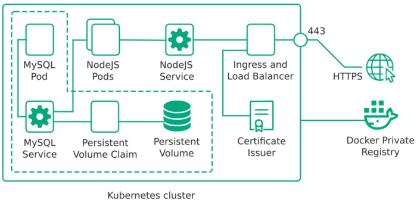

## Docker Image: 
A collection of files that packs together all the necessities needed to set up a completely functional container,

## Container: 
An instance of an image, a running image,

## Node: 
A Kubernetes Object, a virtual machine that runs a container and provide resources,

## Kubernetes Cluster: 
A collection of nodes and configurations to manage them,

## Pod: 
A Kubernetes object, a running container, the smallest deployable units of computing that can be created and managed in kubernetes,

## Deployment: 
A Kubernetes Object, that monitors set of pods, it make sure that those pods are running and make sure to restart pods if they are down,

## Service: 
A Kubernetes Object that provides a way to access a running container(pod),

## Persistent Volume: 
A Kubernete object, is a piece of storage in the cluster,

## Persistent Volume Claim: 
A request for the Persistent Volume storage,

## Kubernetes Config file: 
A file that tells Kubernetes about the different Objects to be created. It's written in YAML syntax.

# CREATE IMAGE FOR DOCKERHUB
sudo docker build -t v2-node-kubernetes .
sudo docker tag v2-node-kubernetes andremaria1980/node-server:v2-node-kubernetes
sudo docker push andremaria1980/node-server:v2-node-kubernetes

# Exemple install minikube 
https://kubernetes.io/blog/2019/03/28/running-kubernetes-locally-on-linux-with-minikube-now-with-kubernetes-1.14-support/

minikube start --vm-driver kvm2
minikube config set vm-driver kvm2
minikube start

# Deploy app
kubectl apply -f kube/node-app-deployment.yaml
kubectl apply -f kube/node-app-service.yaml
minikube service node-app-service --url

[circleci-image]: https://img.shields.io/circleci/build/github/nestjs/nest/master?token=abc123def456
[circleci-url]: https://circleci.com/gh/nestjs/nest